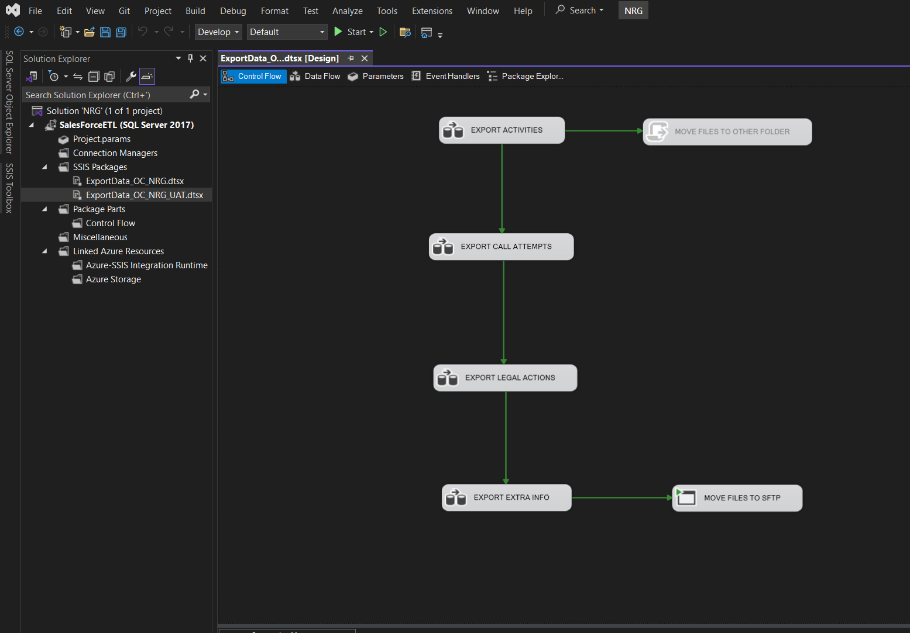

# Project: SSIS ETL Automation (Daily Export)

## Objective

This project involves the development of a daily automated ETL process using SSIS, designed to extract, transform, and deliver data to a remote SFTP server in CSV format. The solution generates four (4) structured files each day and ensures secure and organized file delivery and archival.

---

## Technologies Used

- SQL Server Integration Services (SSIS)
- SQL Server Agent
- SQL Server Stored Procedures
- SFTP File Transfer
- T-SQL
- Windows Server (local storage management)

---

## Implementation Overview

### 1. Data Extraction

Four (4) stored procedures were developed in SQL Server to retrieve data from relevant tables. Each procedure focuses on a distinct data source:

- Procedure 1: Legal Actions
- Procedure 2: Call Attempts
- Procedure 3: Activities
- Procedure 4: Combined Dataset (Extra Info)

### 2. Data Transformation

Two SSIS packages were created:

- `ExportData_OC_NRG.dtsx` (Production version)
- `ExportData_OC_NRG_UAT.dtsx` (Testing/UAT version)

Each package performs the following:
- Executes the stored procedures
- Writes the resulting datasets to four (4) CSV files using data flow tasks

### 3. Data Load (File Delivery)

- The generated CSV files are transferred via SFTP to the remote directory: `/XXX/XXX/`
- The SSIS package handles the SFTP connection and file placement

### 4. Archiving and File Management

- After successful transfer, the local CSV files are moved to an `Archive/` folder on the local server
- A script deletes files older than 7 days from the local directory to maintain storage efficiency

### 5. Scheduling

- The SSIS package is scheduled to run automatically once per day using SQL Server Agent

---

## Folder Structure
/XXX/ ├── ExportData_OC_NRG.dtsx ├── ExportData_OC_NRG_UAT.dtsx └── Other SSIS project files (.dtproj, .sln, etc.)

## Notes

- The solution is parameterized for easy deployment in both UAT and Production environments
- Sensitive information (e.g., credentials) is handled via package configuration and not included in this repository
- Package versions are clearly separated and version-controlled

---

## Package Control Flow Overview

This image illustrates the overall control flow of the SSIS package:

## Developer

This SSIS project was designed, developed and deployed by:

**Konstantinos Panousis**  
April 2025
